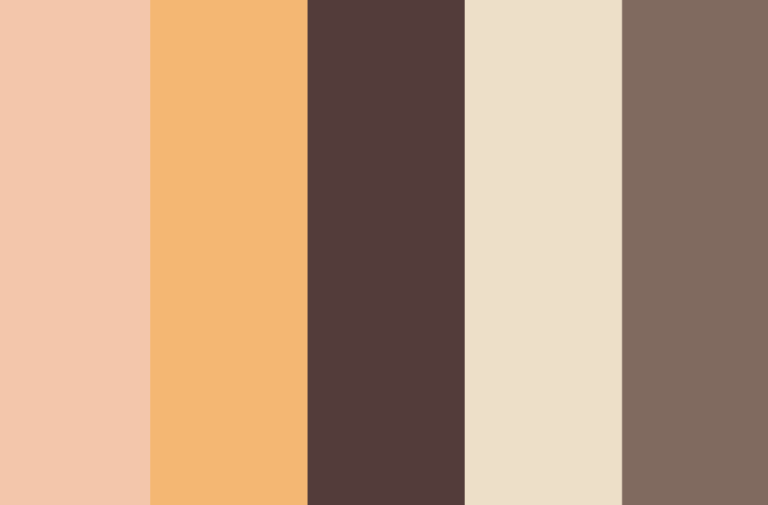

# Portfolio 2025

this is a work in progress

My new portfolio for 2025, coming soon. Here will be the changes:

- Svelte instead of React
- Three.js instead of react-three-fiber (more control)
- 3D section should make more sense (2024 one was so random lol, gotta plan it better with a better theme)
    - (i was rushing on making a portfolio website in 2024, no rush this year ...)
- Will include blender file in the repo
- about me, skills, education + experience merged together, competitions (with pictures), projects (make it more clean), contact (also add a calendly link now)

Theme:

- a boba shop (model a big on the left side)
- make sure i somehow watermark the model (e.g. put my name somewhere as a 3D model affected by light too)
- use image generator to give some inspiration

- Colors palette

